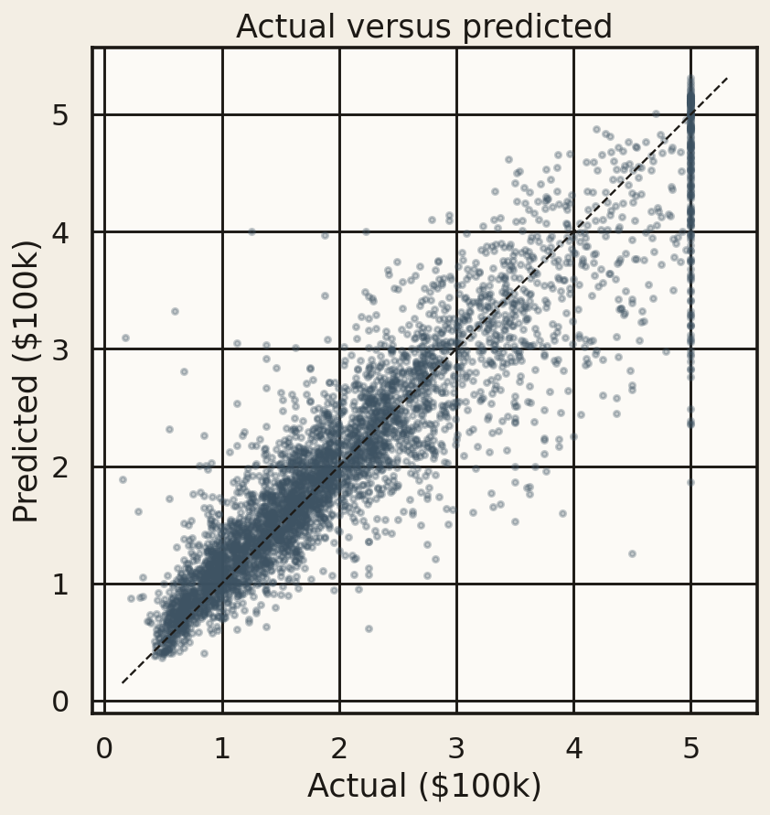
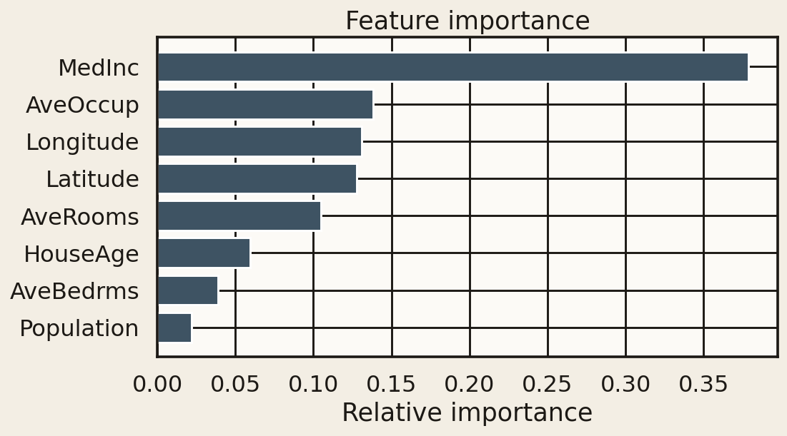

# House Price Prediction using Machine Learning


Regression models that predict median house value for California census block groups. Four estimators, one 80/20 holdout, no test-set leakage.

**Winner: XGBoost** — test R² **0.844**, RMSE **$45,261**, MAE **$29,923**.

## Overview

This project loads the California Housing dataset shipped with scikit-learn (20,640 districts, 8 numeric features, 0 missing values), winsorizes physically implausible occupancy/room ratios using *training-fold* quantiles, and compares linear regression, a lightly tuned decision tree, a random forest, and XGBoost.

## Dataset

[California Housing](https://scikit-learn.org/stable/modules/generated/sklearn.datasets.fetch_california_housing.html) (`sklearn.datasets.fetch_california_housing`). 20,640 samples.

| Column | Meaning | Unit |
| --- | --- | --- |
| MedInc | Median block-group income | tens of thousands USD |
| HouseAge | Median house age | years |
| AveRooms | Average rooms per household | count |
| AveBedrms | Average bedrooms per household | count |
| Population | Block-group population | people |
| AveOccup | Average household occupancy | people |
| Latitude / Longitude | Block-group centroid | degrees |
| **MedHouseVal** (target) | Median house value | **$100,000s**, censored at 5.00001 |

## Approach

- Inspect shape, dtypes, missingness, and the target distribution
- Winsorize AveRooms / AveBedrms / Population / AveOccup at the 1st/99th **training** percentiles
- 80/20 shuffle split, `random_state=42`
- `StandardScaler` fitted on train only — used by linear regression; trees see unscaled features
- Train four models, score MAE / MSE / RMSE / R² on the holdout
- Read feature importance from the winner; plot actual vs predicted and residuals

## Models

- Linear Regression
- Decision Tree Regressor (grid over `max_depth` ∈ {6,8,10,12} and `min_samples_leaf` ∈ {4,8,16})
- Random Forest Regressor (`n_estimators=200`)
- XGBoost Regressor (`n_estimators=300`, `learning_rate=0.05`, `max_depth=6`)

## Results

Holdout (n = 4,128). Target units are $100,000; dollar columns multiply by 100,000.

| Model | MAE | RMSE | R² Score |
| --- | ---: | ---: | ---: |
| **XGBoost** | **0.299 ($29.9k)** | **0.453 ($45.3k)** | **0.844** |
| Random Forest | 0.327 ($32.7k) | 0.505 ($50.5k) | 0.805 |
| Decision Tree | 0.405 ($40.5k) | 0.598 ($59.8k) | 0.727 |
| Linear Regression | 0.498 ($49.8k) | 0.680 ($68.0k) | 0.647 |

XGBoost wins because prices mix smooth income gradients with sharp geographic breaks a single hyperplane cannot represent. Boosting 300 shallow trees beat both a lone tree and a 200-tree forest on the same split.

## Demo

Actual vs predicted (XGBoost holdout) and feature importance:





## Key Insights

- **Median income is 37.8% of XGBoost importance** — ability to pay is the loudest signal.
- **Latitude + longitude together are ~26%** — coastal and Bay Area premiums remain after income is controlled.
- **Average occupancy is the second single feature (13.8%)** — crowded block groups trade cheaper.
- **Rooms matter more than bedrooms or raw population.**
- **The $500k censor shows up in the residuals.** Errors fan out as predictions approach 5.0 because the labels themselves are clipped.

## Project Structure

```text
.
├── notebooks/01_house_price_prediction.ipynb
├── src/data.py          # load, winsorize, split, scale
├── src/models.py        # estimators + metrics
├── src/visualize.py     # figures written to artifacts/
├── src/train.py         # python -m src.train
├── artifacts/           # plots + joblib of the winner
├── reports/             # model_comparison.csv
├── screenshots/         # README figures
└── requirements.txt
```

## Setup

```bash
python -m venv .venv
source .venv/bin/activate   # Windows: .venv\Scripts\activate
pip install -r requirements.txt
```

## How to Run

1. Notebook: `jupyter notebook notebooks/01_house_price_prediction.ipynb`
2. CLI (writes reports, plots, and `artifacts/best_model.joblib`):

```bash
python -m src.train
```

## Future Work

- Ames Housing (many categoricals, a richer feature set)
- Optuna / a wider XGBoost search
- Spatial cross-validation so neighbouring block groups cannot leak
- SHAP values for the booster, not just gain importance

## License

MIT
