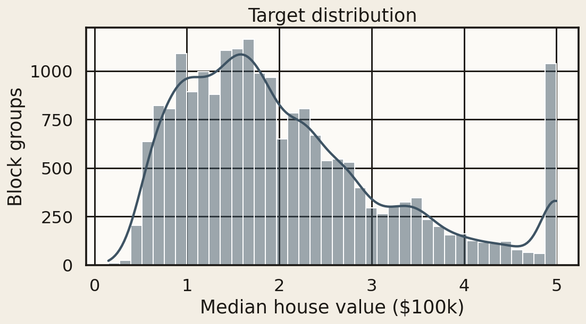
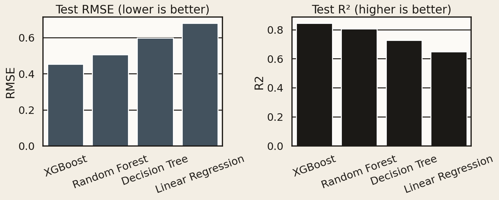
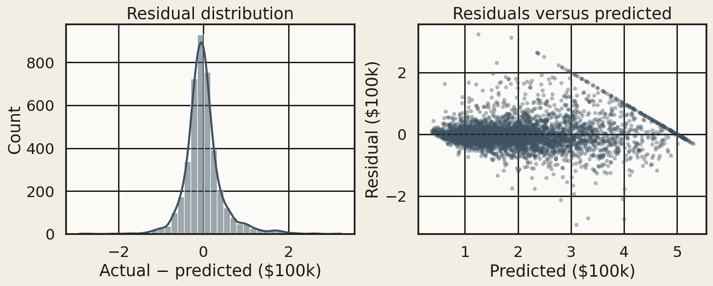

# House Price Prediction using Machine Learning

**Rishabh Sharma** · [GitHub](https://github.com/Rishabhlv2805)

Predict median house values for California census block groups. Four regression models are trained on the same 80/20 split and compared on MAE, MSE, RMSE, and R².

**Dashboard:** [house-price-prediction-using-machine-learning-rs.streamlit.app](https://house-price-prediction-using-machine-learning-rs.streamlit.app/)

## Problem

A block group’s median sale price is driven by income, how crowded the housing is, and where it sits on the map. The goal of this project is to predict that median (`MedHouseVal`) and to be honest about which model actually wins on unseen districts.

## Dataset

[California Housing](https://scikit-learn.org/stable/modules/generated/sklearn.datasets.fetch_california_housing.html) from scikit-learn — 20,640 districts, 8 numeric features, **0 missing values**. No Kaggle download required.

| Feature | Description | Unit |
|---------|-------------|------|
| MedInc | Median household income | tens of thousands of USD |
| HouseAge | Median age of houses | years |
| AveRooms | Average rooms per household | count |
| AveBedrms | Average bedrooms per household | count |
| Population | People in the block group | count |
| AveOccup | Average household size | people |
| Latitude, Longitude | Block-group centroid | degrees |
| **MedHouseVal** | Median house value (target) | **$100,000s**, capped at $500,000 |

The spike at 5.0 on the target histogram is that $500k cap, not a pile of identical homes.



## Method

1. Inspect shape, dtypes, missingness, and the target distribution.
2. 80/20 shuffle split (`random_state=42`) → 16,512 train / 4,128 test.
3. Winsorize `AveRooms`, `AveBedrms`, `Population`, `AveOccup` at the **training** 1st/99th percentiles so a handful of impossible occupancy ratios cannot leak test information into the clip.
4. Fit `StandardScaler` on train only. Linear regression uses the scaled matrix; the tree models use the unscaled one.
5. Train four models on that split and score the holdout.

## Models

| Model | Notes |
|-------|--------|
| Linear Regression | Scaled features, closed-form baseline |
| Decision Tree | Grid over `max_depth` ∈ {6, 8, 10, 12} and `min_samples_leaf` ∈ {4, 8, 16} |
| Random Forest | 200 trees, `min_samples_leaf=2` |
| XGBoost | 300 trees, `learning_rate=0.05`, `max_depth=6`, subsample 0.8 |

## Results

Holdout set, 4,128 districts. Dollar columns = metric × $100,000.

| Model | MAE | MSE | RMSE | R² |
|-------|-----|-----|------|-----|
| Linear Regression | 0.4981 ($49,806) | 0.4620 | 0.6797 ($67,970) | 0.6474 |
| Decision Tree | 0.4045 ($40,454) | 0.3575 | 0.5979 ($59,795) | 0.7272 |
| Random Forest | 0.3269 ($32,693) | 0.2551 | 0.5050 ($50,504) | 0.8054 |
| **XGBoost** | **0.2992 ($29,923)** | **0.2049** | **0.4526 ($45,261)** | **0.8437** |

XGBoost is the winner: lowest error, highest R². Saved as `artifacts/best_model.joblib` when you retrain.




A linear plane cannot represent the Bay Area and the Central Valley with the same slope. That is why RMSE drops from **$67,970** (linear) to **$45,261** (XGBoost). Residuals stay well-behaved until predictions hit the $500k label cap.



## What drives the price

XGBoost gain importance:

| Feature | Importance |
|---------|------------|
| Median income | 37.8% |
| Average occupancy | 13.8% |
| Longitude | 13.1% |
| Latitude | 12.8% |
| Average rooms | 10.5% |
| House age | 5.9% |
| Average bedrooms | 3.9% |
| Population | 2.2% |

Income is the loudest signal. Occupancy is next — crowded block groups sell cheaper. Latitude and longitude together are ~26%, which is the coastal / inland premium after income is already in the model. Raw population barely matters.


## Dashboard

The Streamlit app (`streamlit_app.py`) is the interactive studio:

- **Studio** — R² scorecard, holdout RMSE, importance, headline numbers
- **Data** — target histogram, income vs price, California map, correlation heatmap
- **Models** — MAE / MSE / RMSE / R², actual vs predicted, residuals
- **Estimate** — sliders and region presets. The live dollar figure uses the **linear** coefficients so each slider has an additive, inspectable effect. The published champion is still XGBoost.

Open it here: [house-price-prediction-using-machine-learning-rs.streamlit.app](https://house-price-prediction-using-machine-learning-rs.streamlit.app/)

## Repository layout

```
├── streamlit_app.py          # dashboard (Cloud reads this)
├── notebooks/                # step-by-step analysis
├── src/                      # load, train, plot, evaluate
├── reports/                  # metrics.json + CSV tables
├── screenshots/              # figures used in this README
├── artifacts/                # plots + joblib files from a local retrain
├── requirements.txt          # dashboard (Streamlit Cloud)
├── requirements-train.txt    # notebook + training
└── LICENSE                   # MIT
```

## How to run

**Dashboard (local)**

```bash
python -m venv .venv
source .venv/bin/activate
pip install -r requirements.txt
streamlit run streamlit_app.py
```

**Notebook**

```bash
pip install -r requirements-train.txt
jupyter notebook notebooks/01_house_price_prediction.ipynb
```

**Retrain**

```bash
pip install -r requirements-train.txt
python -m src.train
```

This rewrites `reports/model_comparison.csv`, `reports/metrics.json`, the plots under `artifacts/`, and `artifacts/best_model.joblib`.

## License

MIT © 2026 Rishabh Sharma
